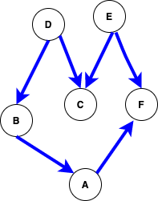
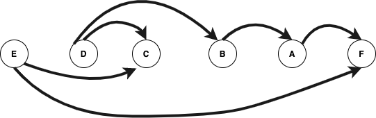

<br>
<br>

Python 3.9 beta has been released and there are some new modules in the store and improved functionalities to look for and implement. So let’s install the new version and then look at the working of a few of the modules and functionalities.


Two new modules have been added in the latest version:
## zoneinfo
```
from zoneinfo import ZoneInfo
from datetime import datetime, timedelta
# IANA time zone support
>>> dt = datetime(2020, 12, 31, 12, tzinfo=ZoneInfo(“Asia/Kolkata”))
>>> dt.tzname()
‘IST’

```
## graphlib
graphlib provides functionality to topologically sort a graph of hashable nodes.
Topological sorting refers to the given digraph G=(V, E), find a linear ordering of vertices such that for all edges (v, w) in E, v-> w from vertex v to vertex w, vertex v comes before vertex w in the ordering.
I’ve tried to explain how topological sorting can be done in the illustration below:




```
>>> import graphlib
>>> from graphlib import TopologicalSorter
>>> graph = {'E': {'C', 'F'}, 'D': {'B', 'C'}, 'B': {'A'}, 'A': {'F'}}
>>> ts = TopologicalSorter(graph)
>>> tuple(ts.static_order())
('C', 'F', 'E', 'A', 'B', 'D')

```

