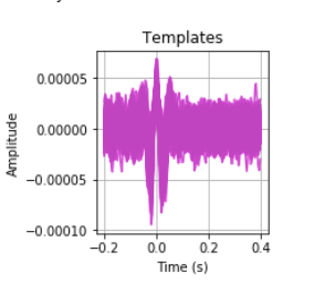

  
  

Emotion estimation using physiological signals- EEG(Electroencephalogram), ECG(Electrocardiogram), GSR(Galvanic Skin Respose) using MAHNOB-HCI data by preprocessing, extracting features and Train Machine Learning Models To Classify Emotions into Fear, Disgust, amusement, sadness, neutral.
Emotion estimation using various sensors is an effective tool. Sensors once attached to our body start tracking the changes in the body. In our report we have done
analysis on data with the following sensors. Electroencephalogram (EEG) headband has electrodes which pick up and record the electrical activity in brain. The Galvanic Skin Response (GSR) physiological signal holds the body’s secreted response of sweat glands. This GSR signal, as an instruction of skin conductance, comes into being at situations where the skin resistance changes due the contractions and dilations of blood vessels and skin and the sweat gland secretion. The
Electrocardiogram (ECG) measures the electrical activity of the heart. Every heartbeat is triggered by an electrical signal that’s from top of the heart and travels to bottom.

For this project, I did the preprocessing, feature extraction, Normalization of EEG,GSR & ECG signals. Preprocessing involved Filtering, noise reduction, channel selection. Feature extraction involved taking features such as Standard Deviation, Maximum, Minimum, MinRatio of the signals in GSR, Spectral Entropy, Mean Signal in EEG signals,Cardiac Stress Index(CSI),proportion of N-N interval/total time segment in ECG. The training and implementation of the model(EEG,ECG,GSR) was also done by me

You can learn more at https://github.com/meghamodi/Emotion-Recognition.

